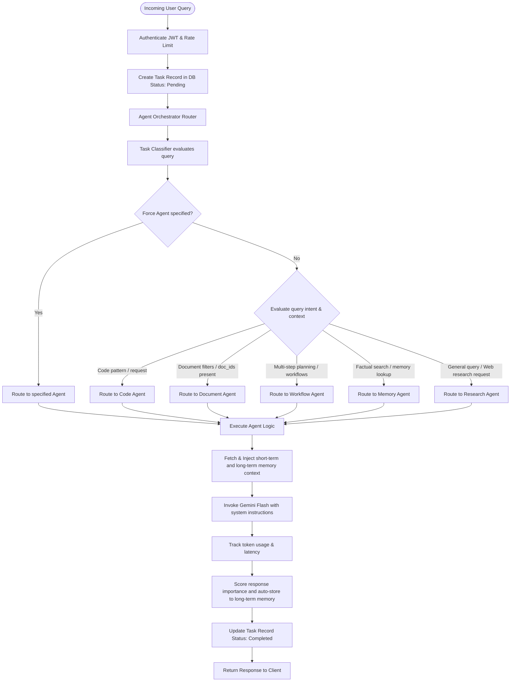

# Agent Routing Decision Flow

```mermaid
flowchart TD
    Start([Incoming User Query]) --> Auth[Authenticate JWT & Rate Limit]
    Auth --> CreateTask[Create Task Record in DB Status: Pending]
    CreateTask --> Router[Agent Orchestrator Router]
    
    Router --> Classify[Task Classifier evaluates query]
    Classify --> CheckForce{Force Agent specified?}
    
    CheckForce -->|Yes| RouteForced[Route to specified Agent]
    CheckForce -->|No| EvalIntent{Evaluate query intent & context}
    
    EvalIntent -->|Code pattern / request| RouteCode[Route to Code Agent]
    EvalIntent -->|Document filters / doc_ids present| RouteDoc[Route to Document Agent]
    EvalIntent -->|Multi-step planning / workflows| RouteWorkflow[Route to Workflow Agent]
    EvalIntent -->|Factual search / memory lookup| RouteMemory[Route to Memory Agent]
    EvalIntent -->|General query / Web research request| RouteResearch[Route to Research Agent]
    
    RouteForced --> ExecuteAgent[Execute Agent Logic]
    RouteCode --> ExecuteAgent
    RouteDoc --> ExecuteAgent
    RouteWorkflow --> ExecuteAgent
    RouteMemory --> ExecuteAgent
    RouteResearch --> ExecuteAgent
    
    ExecuteAgent --> InjectContext[Fetch & Inject short-term and long-term memory context]
    InjectContext --> CallLLM[Invoke Gemini Flash with system instructions]
    CallLLM --> TrackToken[Track token usage & latency]
    TrackToken --> AutoMemory[Score response importance and auto-store to long-term memory]
    AutoMemory --> CompleteTask[Update Task Record Status: Completed]
    CompleteTask --> Return[Return Response to Client]
```
