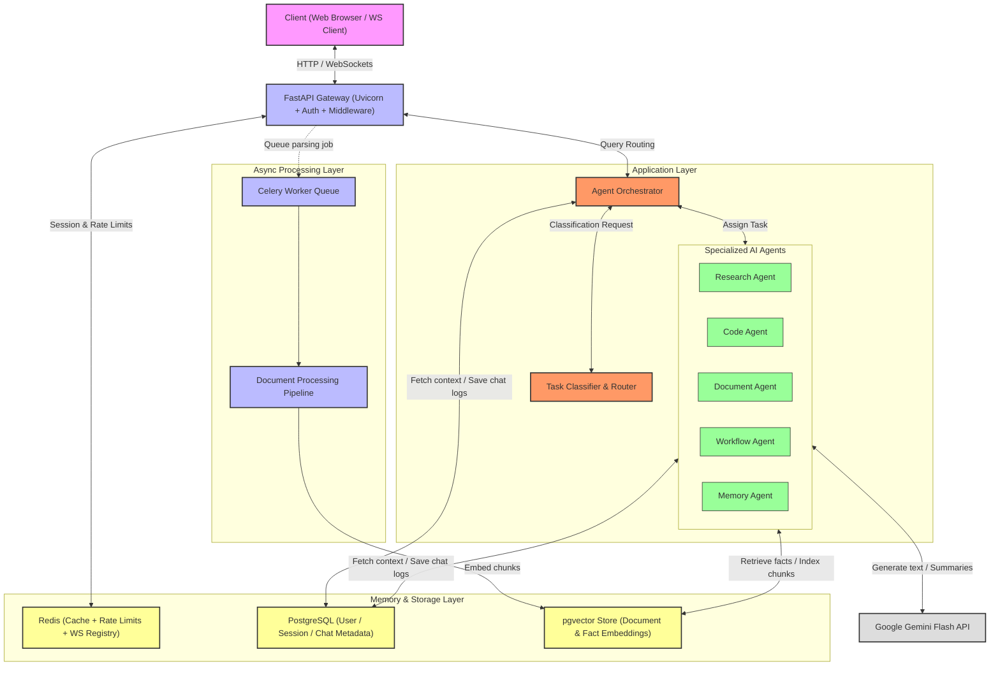

# Full System Architecture

```mermaid
graph TD
    classDef client fill:#f9f,stroke:#333,stroke-width:2px;
    classDef gateway fill:#bbf,stroke:#333,stroke-width:2px;
    classDef orchestrator fill:#f96,stroke:#333,stroke-width:2px;
    classDef agent fill:#9f9,stroke:#333,stroke-width:1px;
    classDef storage fill:#ff9,stroke:#333,stroke-width:2px;
    classDef external fill:#ddd,stroke:#333,stroke-width:2px;

    Client["Client (Web Browser / WS Client)"]:::client
    Gateway["FastAPI Gateway (Uvicorn + Auth + Middleware)"]:::gateway
    
    subgraph Core_Application [Application Layer]
        Orchestrator["Agent Orchestrator"]:::orchestrator
        Classifier["Task Classifier & Router"]:::orchestrator
        
        subgraph Agents [Specialized AI Agents]
            ResearchAgent["Research Agent"]:::agent
            CodeAgent["Code Agent"]:::agent
            DocAgent["Document Agent"]:::agent
            WorkflowAgent["Workflow Agent"]:::agent
            MemoryAgent["Memory Agent"]:::agent
        end
    end
    
    subgraph Memory_Storage [Memory & Storage Layer]
        RedisCache["Redis (Cache + Rate Limits + WS Registry)"]:::storage
        PostgresDB["PostgreSQL (User / Session / Chat Metadata)"]:::storage
        PgVector["pgvector Store (Document & Fact Embeddings)"]:::storage
    end
    
    subgraph Background_Workers [Async Processing Layer]
        CeleryApp["Celery Worker Queue"]:::gateway
        DocIngest["Document Processing Pipeline"]:::gateway
    end

    GeminiAPI["Google Gemini Flash API"]:::external

    %% Flow connections
    Client <-->|HTTP / WebSockets| Gateway
    Gateway <-->|Query Routing| Orchestrator
    Orchestrator <-->|Classification Request| Classifier
    Orchestrator <-->|Assign Task| Agents
    
    %% Storage connections
    Gateway <-->|Session & Rate Limits| RedisCache
    Orchestrator & Agents <-->|Fetch context / Save chat logs| PostgresDB
    Agents <-->|Retrieve facts / Index chunks| PgVector
    
    %% Celery connections
    Gateway -.->|Queue parsing job| CeleryApp
    CeleryApp --> DocIngest
    DocIngest -->|Embed chunks| PgVector
    
    %% LLM connections
    Agents <-->|Generate text / Summaries| GeminiAPI
```
