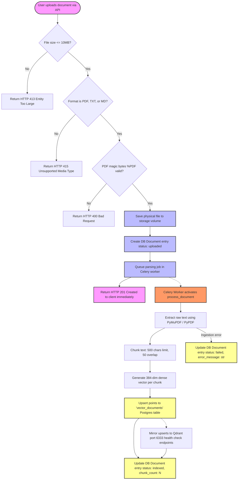

# Document Ingestion Pipeline

```mermaid
flowchart TD
    classDef client fill:#f9f,stroke:#333,stroke-width:2px;
    classDef gateway fill:#bbf,stroke:#333,stroke-width:2px;
    classDef worker fill:#f96,stroke:#333,stroke-width:2px;
    classDef storage fill:#ff9,stroke:#333,stroke-width:2px;

    Upload([User uploads document via API]):::client --> SizeCheck{File size <= 10MB?}
    SizeCheck -->|No| Fail413[Return HTTP 413 Entity Too Large]
    SizeCheck -->|Yes| FormatCheck{Format is PDF, TXT, or MD?}
    
    FormatCheck -->|No| Fail415[Return HTTP 415 Unsupported Media Type]
    FormatCheck -->|Yes| MagicCheck{PDF magic bytes %PDF valid?}
    
    MagicCheck -->|No| Fail400[Return HTTP 400 Bad Request]
    MagicCheck -->|Yes| SaveFile[Save physical file to storage volume]:::gateway
    
    SaveFile --> CreateRecord[Create DB Document entry status: uploaded]:::gateway
    CreateRecord --> QueueTask[Queue parsing job in Celery worker]:::gateway
    QueueTask --> Return201[Return HTTP 201 Created to client immediately]:::client
    
    QueueTask -.-> Worker[Celery Worker activates process_document]:::worker
    Worker --> ExtractText[Extract raw text using PyMuPDF / PyPDF]
    
    ExtractText --> ChunkText[Chunk text: 500 chars limit, 50 overlap]
    ChunkText --> GenerateEmbeddings[Generate 384-dim dense vector per chunk]
    
    GenerateEmbeddings --> UpsertDB[Upsert points to 'vector_documents' Postgres table]:::storage
    UpsertDB -.-> MirrorQdrant[Mirror upserts to Qdrant port 6333 health check endpoints]
    
    UpsertDB --> UpdateStatus[Update DB Document entry status: indexed, chunk_count: N]:::storage
    MirrorQdrant --> UpdateStatus
    
    ExtractText -- Ingestion error --> UpdateFailed[Update DB Document entry status: failed, error_message: str]:::storage
```
