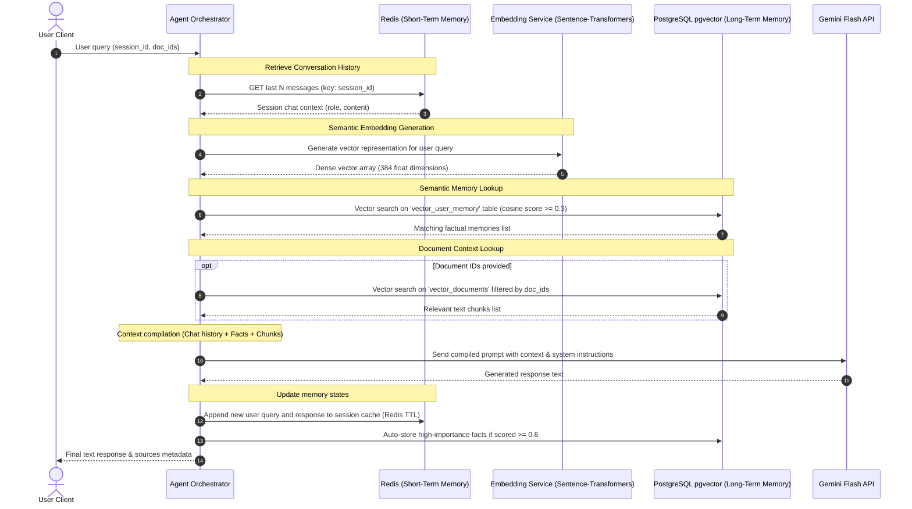

# Memory Retrieval Pipeline

```mermaid
sequenceDiagram
    autonumber
    actor Client as User Client
    participant Orc as Agent Orchestrator
    participant Cache as Redis (Short-Term Memory)
    participant Embed as Embedding Service (Sentence-Transformers)
    participant VectorStore as PostgreSQL pgvector (Long-Term Memory)
    participant LLM as Gemini Flash API

    Client->>Orc: User query (session_id, doc_ids)
    
    %% Short-term memory retrieval
    Note over Orc, Cache: Retrieve Conversation History
    Orc->>Cache: GET last N messages (key: session_id)
    Cache-->>Orc: Session chat context (role, content)
    
    %% Embedding generation
    Note over Orc, Embed: Semantic Embedding Generation
    Orc->>Embed: Generate vector representation for user query
    Embed-->>Orc: Dense vector array (384 float dimensions)
    
    %% Long-term memory query
    Note over Orc, VectorStore: Semantic Memory Lookup
    Orc->>VectorStore: Vector search on 'vector_user_memory' table (cosine score >= 0.3)
    VectorStore-->>Orc: Matching factual memories list
    
    %% Document search
    Note over Orc, VectorStore: Document Context Lookup
    opt Document IDs provided
        Orc->>VectorStore: Vector search on 'vector_documents' filtered by doc_ids
        VectorStore-->>Orc: Relevant text chunks list
    end
    
    %% Context formulation and LLM call
    Note over Orc: Context compilation (Chat history + Facts + Chunks)
    Orc->>LLM: Send compiled prompt with context & system instructions
    LLM-->>Orc: Generated response text
    
    %% Store new state
    Note over Orc, Cache: Update memory states
    Orc->>Cache: Append new user query and response to session cache (Redis TTL)
    Orc->>VectorStore: Auto-store high-importance facts if scored >= 0.6
    
    Orc-->>Client: Final text response & sources metadata
```
