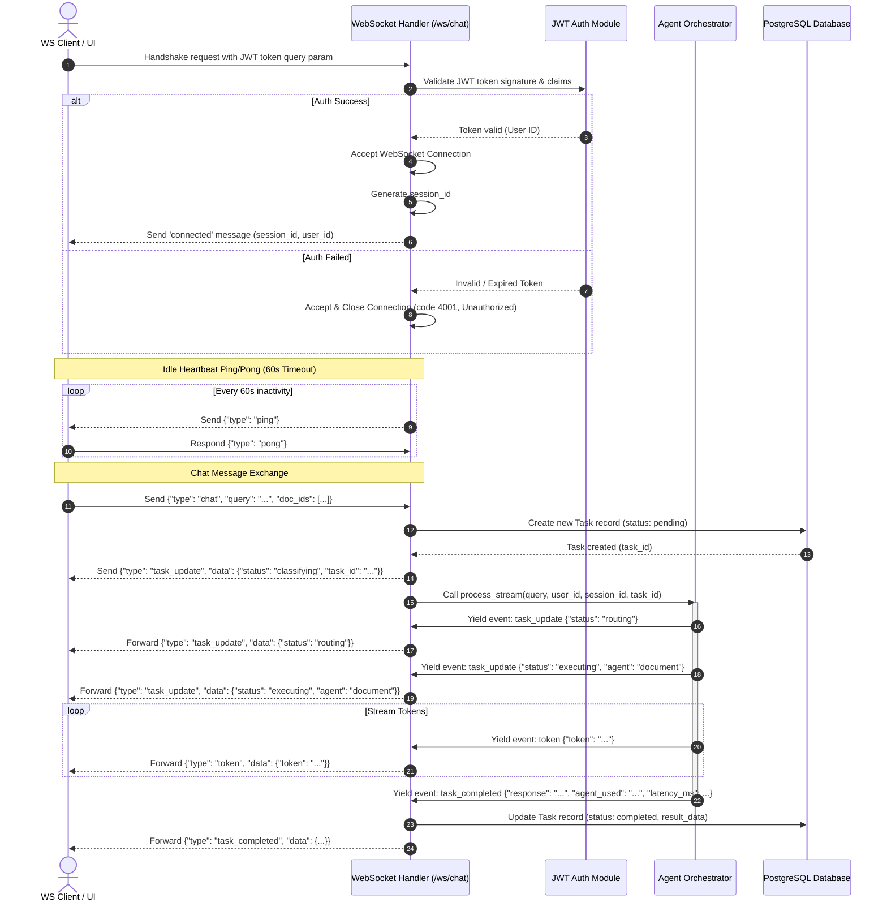

# WebSocket Chat Streaming Sequence

```mermaid
sequenceDiagram
    autonumber
    actor Client as WS Client / UI
    participant WS as WebSocket Handler (/ws/chat)
    participant Auth as JWT Auth Module
    participant Orc as Agent Orchestrator
    participant DB as PostgreSQL Database

    Client->>WS: Handshake request with JWT token query param
    WS->>Auth: Validate JWT token signature & claims
    
    alt Auth Success
        Auth-->>WS: Token valid (User ID)
        WS->>WS: Accept WebSocket Connection
        WS->>WS: Generate session_id
        WS-->>Client: Send 'connected' message (session_id, user_id)
    else Auth Failed
        Auth-->>WS: Invalid / Expired Token
        WS->>WS: Accept & Close Connection (code 4001, Unauthorized)
    end

    %% Heartbeat protocol
    Note over Client, WS: Idle Heartbeat Ping/Pong (60s Timeout)
    loop Every 60s inactivity
        WS-->>Client: Send {"type": "ping"}
        Client->>WS: Respond {"type": "pong"}
    end

    %% Conversation exchange
    Note over Client, WS: Chat Message Exchange
    Client->>WS: Send {"type": "chat", "query": "...", "doc_ids": [...]}
    WS->>DB: Create new Task record (status: pending)
    DB-->>WS: Task created (task_id)
    WS-->>Client: Send {"type": "task_update", "data": {"status": "classifying", "task_id": "..."}}

    %% Stream Processing
    WS->>Orc: Call process_stream(query, user_id, session_id, task_id)
    activate Orc
    
    Orc->>WS: Yield event: task_update {"status": "routing"}
    WS-->>Client: Forward {"type": "task_update", "data": {"status": "routing"}}
    
    Orc->>WS: Yield event: task_update {"status": "executing", "agent": "document"}
    WS-->>Client: Forward {"type": "task_update", "data": {"status": "executing", "agent": "document"}}
    
    loop Stream Tokens
        Orc->>WS: Yield event: token {"token": "..."}
        WS-->>Client: Forward {"type": "token", "data": {"token": "..."}}
    end
    
    Orc->>WS: Yield event: task_completed {"response": "...", "agent_used": "...", "latency_ms": ...}
    deactivate Orc
    WS->>DB: Update Task record (status: completed, result_data)
    WS-->>Client: Forward {"type": "task_completed", "data": {...}}
```
